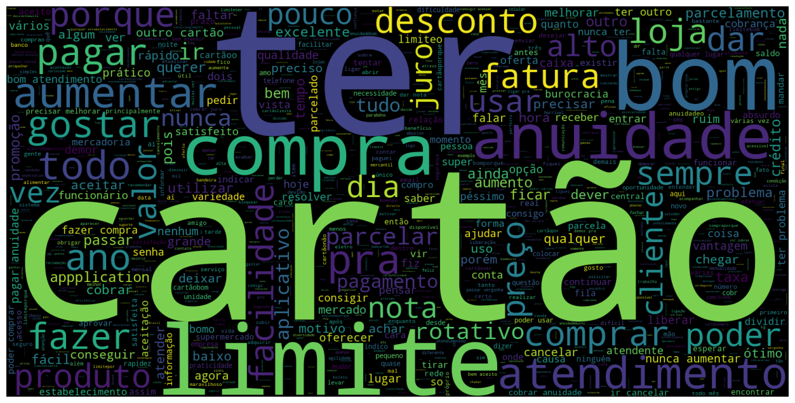
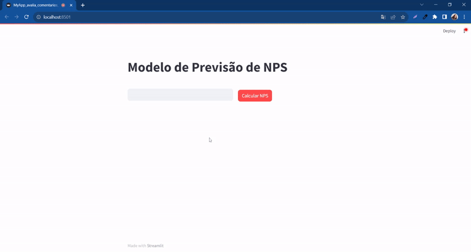
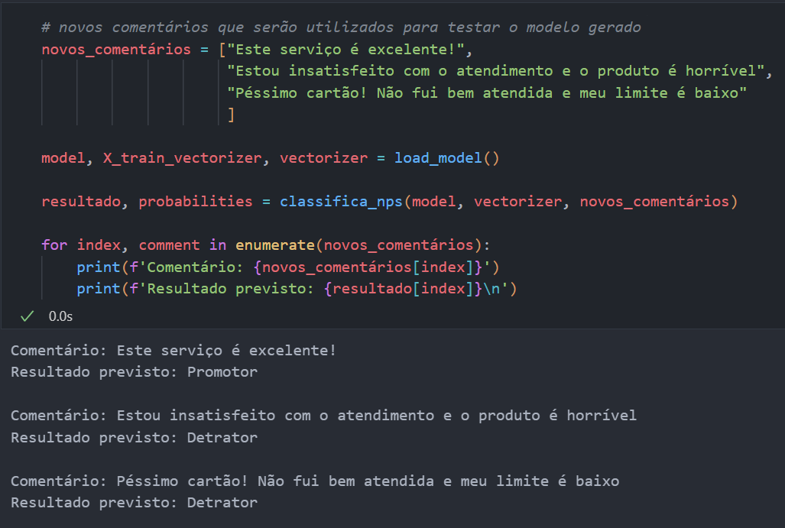

# Text Based Nps Predictor

Este projeto teve como objetivo criar um classificador utlizando técnicas de NLP para fazer a previsão do NPS (Net Promoter Score) de um cliente baseado em comentários digitados pelo usuário.

A partir de um comentário é possível indicar a previsão da classificação do NPS do cliente que pode ser: Detrator, neutro ou promotor.[1](https://pt.wikipedia.org/wiki/Net_Promoter_Score)

## Exemplos:
É possível utilizar o modelo diretamente no navegador conforme o vídeo abaixo com apenas 1 comando no terminal:

"py -m streamlit run my_app_NPS.py"

Ou utilizar diretamente no código para avaliar diversos comentários ao mesmo tempo

## Aplicações:
Com a utilização do modelo é possível agilizar a avaliação de comentários e a classificação do NPS de maneira a possibilitar uma resposta mais rápida aos clientes de uma empresa. 

Um cliente respondeu uma pesquisa de satisfação e está muito insatisfeito? É possível detectar isso em tempo real com o modelo treinado e iniciar uma ação de prevenção de cancelamento por exemplo o disparo de uma comunicação ou alerta na central de relacionamento com o cliente.

## Pacotes Requeridos
- python 3
- pandas
- numpy
- scipy
- sklearn
- nltk
- spacy
- python -m spacy download pt_core_news_sm
- plotly
- wordcloud
- enelvo
